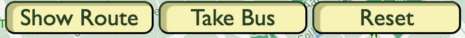
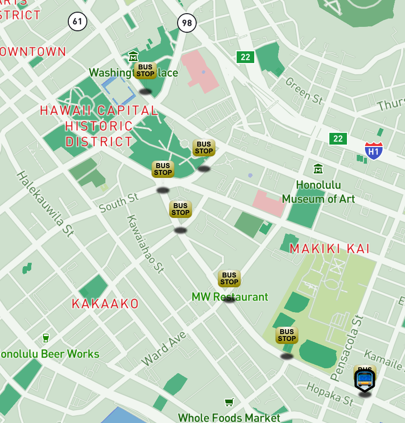
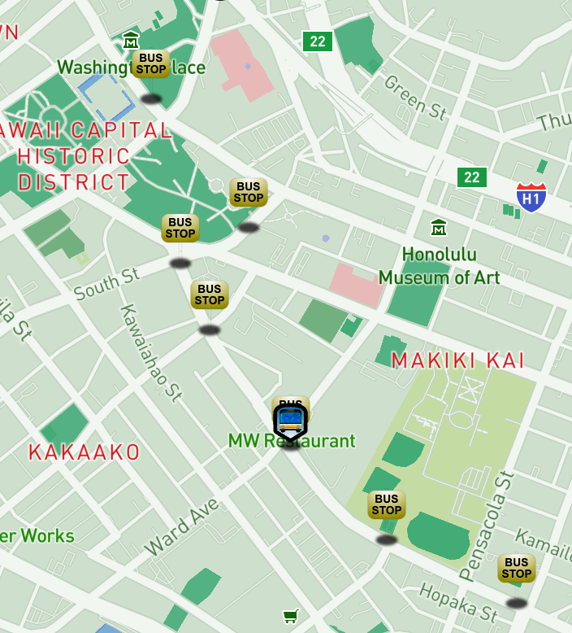
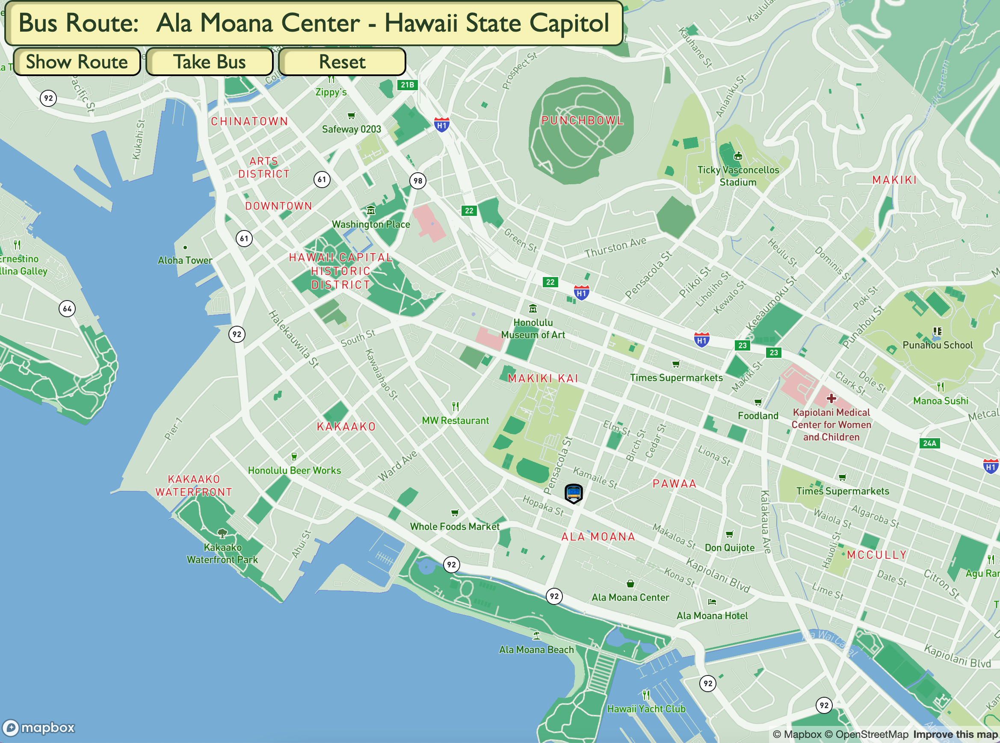

# Real Time Bus Tracker

##### An interactive map of the Honolulu district on the island of Oahu, Hawaii that shows the bus route from the Ala Moana Shopping Center to the State Capitol building.

#### Interactive Buttons

##### "Show Route" Button will show all the bus stops along the route.

##### "Take Bus" will move the bus icon along the route until it arrives at the final stop.

##### "Reset" will clear the map to its original state.

##### Icons used for project

##### This project was built by using Mapbox's API.

[Link: mapbox.com](https://www.mapbox.com)

##### SVG images were created by using Affinity designer.

##### Custom styling and code using HTML, CSS and JavaScript.
